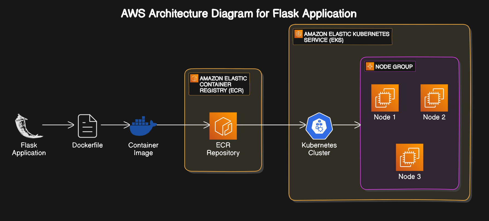
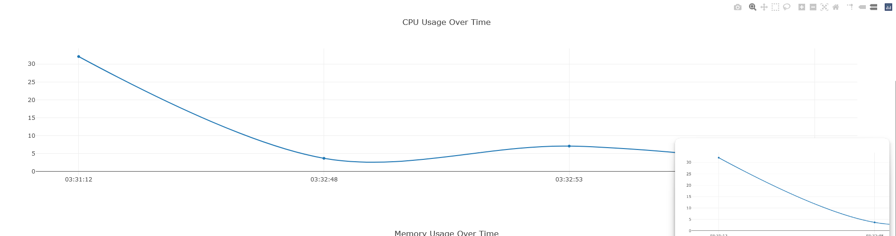
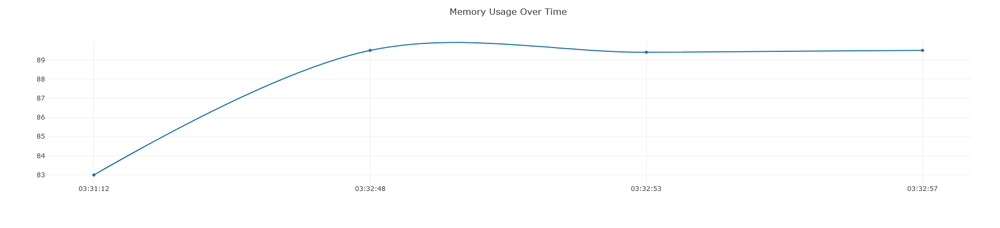
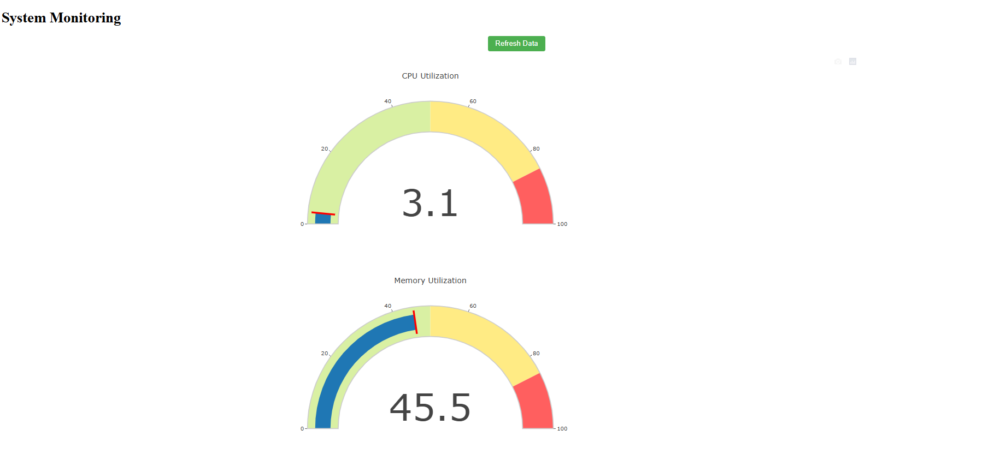

<!DOCTYPE html>
<html lang="en">
<head>
    <meta charset="UTF-8">
    <meta name="viewport" content="width=device-width, initial-scale=1.0">
    <title>Flask Application Deployment on Amazon EKS</title>
</head>
<body>

<h1>Flask Application Deployment on Amazon EKS</h1>

This guide details how to deploy a Flask application on Amazon Elastic Kubernetes Service (EKS), using Amazon Elastic Container Registry (ECR) to store Docker images.

<h2>Prerequisites</h2>
<ol>
    <li><strong>AWS Account</strong> with IAM permissions to manage EKS, EC2, and ECR.</li>
    <li><strong>AWS CLI</strong> installed and configured:
        <pre><code>aws configure</code></pre>
    </li>
    <li><strong>kubectl</strong> installed for Kubernetes management.</li>
    <li><strong>Docker</strong> installed for building images.</li>
    <li><strong>Python</strong> and <strong>Flask</strong> for developing the application (optional for development).</li>
</ol>

<h2>Steps</h2>

<h3>1. Create a Flask Application</h3>

Create a basic Flask application.

<pre><code># app.py
from flask import Flask

app = Flask(**name**)

@app.route('/')
def home():
return "Hello, EKS!"

if **name** == "**main**":
app.run(host="0.0.0.0", port=5000)
</code></pre>

<h3>2. Dockerize the Application</h3>

Create a Dockerfile for the Flask app.

<pre><code># Dockerfile
# Use the Python 3.9 image

FROM python:3.9-slim-buster

WORKDIR /app

COPY requirements.txt .

RUN pip3 install --no-cache-dir -r requirements.txt

COPY . .

ENV FLASK_RUN_HOST=0.0.0.0

EXPOSE 5000

CMD ["gunicorn", "--bind", "0.0.0.0:5000", "app:app"]

</code></pre>

Create a <code>requirements.txt</code> file for Flask.

<pre>
<code># requirements.txt
flask==2.0.1
Flask==2.2.3
MarkupSafe==2.1.2
Werkzeug==2.2.3
itsdangerous==2.1.2
psutil==5.8.0
boto3==1.9.148
kubernetes==10.0.1
plotly==5.5.0
tenacity==8.0.1
gunicorn==20.1.0

</code>
</pre>

<h3>3. Build and Push the Docker Image to Amazon ECR</h3>
<ol>
    <li>Create an ECR repository:
        <pre><code>aws ecr create-repository --repository-name flask-monitoring-repo --region ap-south-1</code></pre>
    </li>
    <li>Authenticate Docker with ECR:
        <pre><code>aws ecr get-login-password --region ap-south-1 | docker login --username AWS --password-stdin &lt;aws_account_id&gt;.dkr.ecr.ap-south-1.amazonaws.com</code></pre>
    </li>
    <li>Build the Docker image:
        <pre><code>docker build -t flask-monitoring-repo .</code></pre>
    </li>
    <li>Tag the Docker image:
        <pre><code>docker tag flask-monitoring-repo:latest &lt;aws_account_id&gt;.dkr.ecr.ap-south-1.amazonaws.com/flask-monitoring-repo:latest</code></pre>
    </li>
    <li>Push the Docker image to ECR:
        <pre><code>docker push &lt;aws_account_id&gt;.dkr.ecr.ap-south-1.amazonaws.com/flask-monitoring-repo:latest</code></pre>
    </li>
</ol>

<h3>4. Set Up an EKS Cluster</h3>
<ol>
    <li>Create the EKS Cluster (or use an existing cluster):
        <pre><code>aws eks create-cluster --name Cloude_Native_Cluster --region ap-south-1 --kubernetes-version 1.21 --role-arn &lt;eks_role_arn&gt; --resources-vpc-config subnetIds=&lt;subnet_id1&gt;,&lt;subnet_id2&gt;,&lt;subnet_id3&gt;,securityGroupIds=&lt;security_group_id&gt;</code></pre>
    </li>
    <li>Update kubeconfig to use your EKS cluster:
        <pre><code>aws eks update-kubeconfig --name Cloude_Native_Cluster --region ap-south-1</code></pre>
    </li>
    <li>Verify cluster access:
        <pre><code>kubectl get nodes</code></pre>
    </li>
</ol>

<h3>5. Create Deployment and Service for the Flask Application</h3>
<ol>
    <li>Create a Deployment: This file, <code>deployment.yaml</code>, defines the deployment of the Flask app.
        <pre><code>apiVersion: apps/v1
kind: Deployment
metadata:
  name: my-flask-app
spec:
  replicas: 1
  selector:
    matchLabels:
      app: my-flask-app
  template:
    metadata:
      labels:
        app: my-flask-app
    spec:
      containers:
      - name: my-flask-container
        image: &lt;aws_account_id&gt;.dkr.ecr.ap-south-1.amazonaws.com/flask-monitoring-repo:latest
        ports:
        - containerPort: 5000
</code></pre>
    </li>
    <li>Create a Service: This file, <code>service.yaml</code>, defines how to expose the Flask app.
        <pre><code>apiVersion: v1
kind: Service
metadata:
  name: my-flask-service
spec:
  selector:
    app: my-flask-app
  ports:
    - protocol: TCP
      port: 5000
      targetPort: 5000
  type: LoadBalancer
</code></pre>
    </li>
    <li>Apply the Deployment and Service:
        <pre><code>kubectl apply -f deployment.yaml
kubectl apply -f service.yaml</code></pre>
    </li>
    <li>Verify the Deployment:
        <pre><code>kubectl get pods
kubectl get svc</code></pre>
    </li>
</ol>

<h3>6. Access the Flask Application</h3>
<ol>
    <li>Wait for the LoadBalancer to assign an external IP to <code>my-flask-service</code>:
        <pre><code>kubectl get svc my-flask-service</code></pre>
    </li>
    <li>Once the <code>EXTERNAL-IP</code> field is populated, access the application:
        <pre><code>http://&lt;external-ip&gt;:5000</code></pre>
    </li>
</ol>

<h3>Troubleshooting</h3>
<ul>
    <li><strong>Pending Pods</strong>: Check if nodes are at capacity. Scale the node group or increase node size.</li>
    <li><strong>No External IP</strong>: Ensure <code>my-flask-service</code> has <code>type: LoadBalancer</code>. If on <code>ClusterIP</code>, use <code>kubectl port-forward</code> as a temporary solution.</li>
</ul>

<h3>Cleaning Up</h3>

To avoid incurring costs, delete the EKS cluster and associated resources when you're done.

<pre><code>aws eks delete-cluster --name Cloude_Native_Cluster
aws ecr delete-repository --repository-name flask-monitoring-repo --force
</code></pre>

<h2>Conclusion</h2>

This guide covers deploying a simple Flask application on Amazon EKS using ECR for container storage. With these steps, you can easily scale and manage your application on AWS.

# architecture diagram:-

# CPU Usage Line Chart

# memory Usage Line Chart

<video width="320" height="240" controls>
  <source src="video.mp4" type="video/mp4">
</video>

https://github.com/user-attachments/assets/b5a1ce59-a50c-4cb5-9696-0911a42eee21

</body>
</html>
